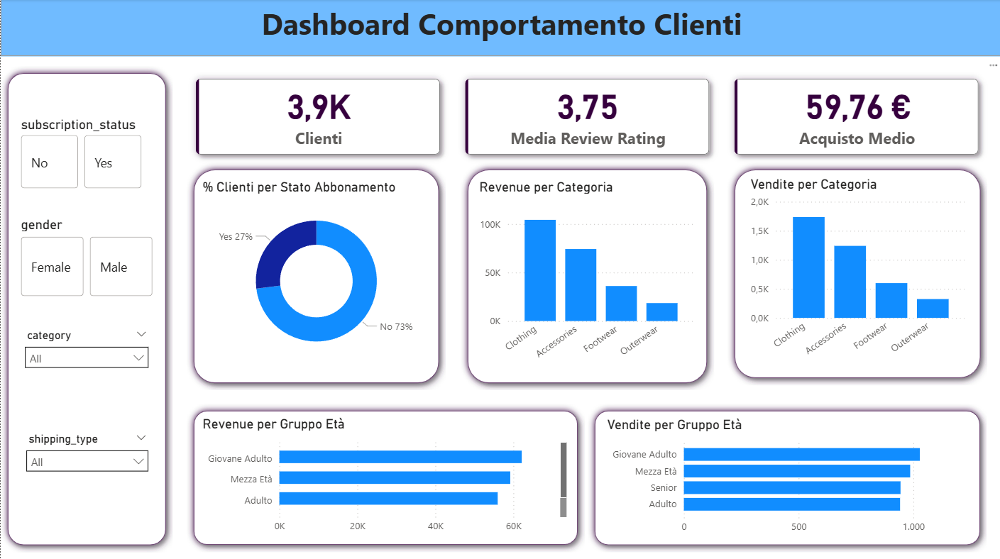

# 🛍️ Customer Shopping Behavior — Analisi e Dashboard

## 📌 Descrizione del Progetto

Questo progetto analizza il comportamento d'acquisto di un campione di clienti, partendo dalla pulizia e trasformazione dei dati raw fino alla creazione di una dashboard interattiva. L'obiettivo è estrarre insight utili su segmenti di clientela, preferenze di prodotto, efficacia degli sconti e pattern di acquisto.

---

## 🗂️ Struttura della Repository

```
├── script_python/
│   └── Customer_Shopping_Analisi_Comportamento.ipynb   # Notebook di data cleaning e feature engineering
├── scripts_sql/
│   ├── 00_DDL_Database_SQL.sql                          # Schema del database PostgreSQL
│   └── SQL_Queries.sql                                  # Query di analisi
└── README.md
```

---
Dashboard



## 🔄 Pipeline del Progetto

### 1. Data Cleaning & Feature Engineering (Python / Pandas)

Il notebook si occupa di preparare il dataset `customer_shopping_behavior.csv` per l'analisi:

- **Esplorazione iniziale**: ispezione della struttura, tipi di dato e valori nulli
- **Gestione dei missing values**: i valori mancanti di `Review Rating` vengono imputati con la mediana calcolata per categoria merceologica
- **Normalizzazione dei nomi delle colonne**: tutti i nomi sono convertiti in lowercase con underscore per uniformità
- **Creazione di nuove feature**:
  - `age_groups`: segmentazione dei clienti in 4 fasce d'età tramite quantili (Giovane Adulto, Adulto, Mezza Età, Senior)
  - `purchase_frequency_days`: conversione della frequenza d'acquisto testuale in valore numerico (es. "Weekly" → 7)
- **Rimozione di colonne ridondanti**: `promo_code_used` risulta identica a `discount_applied` e viene rimossa
- **Export**: il dataset pulito viene salvato come `customer_behavior.csv` per il caricamento su PostgreSQL

### 2. Database Setup (SQL / PostgreSQL)

Il file DDL definisce la tabella `customer_behavior` su PostgreSQL con i tipi di dato appropriati, pronta per accogliere il dataset processato dal notebook.

### 3. Analisi con SQL

Le query coprono diversi ambiti di analisi:

| Area | Esempi di analisi |
|---|---|
| **Revenue** | Totale vendite per genere, contributo per fascia d'età |
| **Prodotti** | Top 5 per media recensioni, top 3 per categoria, % sconto applicato |
| **Clienti** | Abbonati vs non abbonati, segmentazione per storico acquisti |
| **Spedizioni** | Confronto spesa media Standard vs Express |
| **Sconti** | Clienti con sconto che superano la spesa media |

Tecniche SQL utilizzate: subquery, CTE (`WITH`), window functions (`ROW_NUMBER`, `SUM OVER`), `CASE WHEN`, `ROUND` con cast esplicito.

---

## 🛠️ Tecnologie Utilizzate

- **Python** — Pandas, Jupyter Notebook
- **SQL** — PostgreSQL
- **BI Tool** — PowerBI

---

## 📊 Dataset

Il dataset originale contiene **3.900 record** e **18 colonne**, con informazioni su clienti di un e-commerce: età, genere, prodotti acquistati, importo, metodo di pagamento, tipo di spedizione, stato abbonamento e frequenza d'acquisto.
