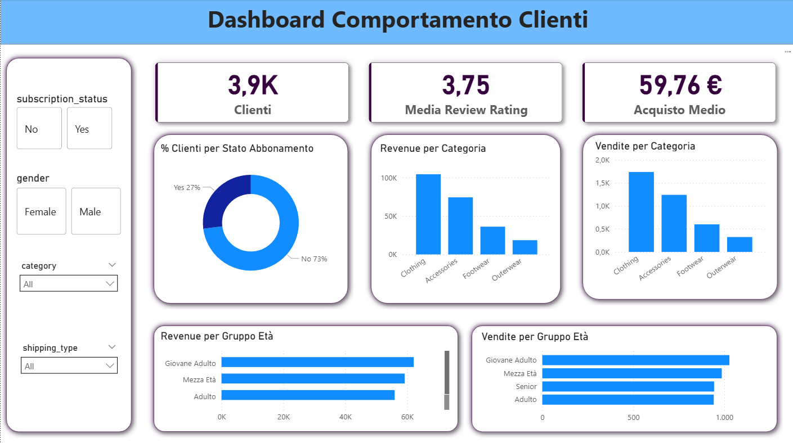

# Customer Shopping Behavior — Analisi e Dashboard

Un cliente di e-commerce lascia tracce in ogni acquisto: cosa compra, quanto spende, con che frequenza torna, se risponde agli sconti. Questo progetto trasforma 3.900 transazioni grezze in insight concreti sul comportamento d'acquisto, costruendo una pipeline completa da Python fino alla dashboard finale.

---

## Il Problema

Il dataset originale era utilizzabile, ma non analizzabile: nomi di colonne non uniformi, valori mancanti nelle recensioni, frequenze d'acquisto espresse come testo, e una colonna duplicata che avrebbe inquinato qualsiasi analisi sugli sconti. Prima di rispondere a qualsiasi domanda di business, i dati andavano preparati.

---

## La Pipeline

### Fase 1 — Pulizia e Preparazione (Python / Pandas)

Il notebook trasforma il CSV grezzo in un dataset pronto per l'analisi:

**Missing values** → I 37 valori mancanti in `Review Rating` vengono imputati con la mediana calcolata per categoria merceologica, non con una mediana globale. La scelta è intenzionale: un prodotto di abbigliamento e uno di elettronica hanno distribuzioni di voti diverse.

**Feature Engineering** → Due nuove colonne create da dati esistenti:
- `age_groups`: i clienti vengono segmentati in 4 fasce d'età tramite quantili (Giovane Adulto, Adulto, Mezza Età, Senior) — confini definiti dai dati, non arbitrari
- `purchase_frequency_days`: la frequenza testuale ("Weekly", "Fortnightly"...) viene convertita in giorni numerici per renderla confrontabile

**Rilevamento duplicati concettuali** → `promo_code_used` e `discount_applied` risultano identiche al 100% su tutti i 3.900 record. La colonna ridondante viene rimossa prima del caricamento su database.

### Fase 2 — Analisi (SQL / PostgreSQL)

Con il dataset pulito caricato su PostgreSQL, le query rispondono a domande business specifiche:

| Domanda | Tecnica |
|---|---|
| Quali prodotti hanno le recensioni migliori per categoria? | `ROW_NUMBER() OVER(PARTITION BY category)` |
| I clienti scontati spendono comunque sopra la media? | Subquery con soglia dinamica |
| Gli abbonati generano più revenue? | Aggregazione con confronto diretto |
| Come si distribuisce il profitto per fascia d'età? | `SUM() OVER()` per contributo percentuale |
| Quali prodotti ricevono più sconti? | `CASE WHEN` con percentuale calcolata |

### Fase 3 — Dashboard (Power BI)

I risultati dell'analisi SQL confluiscono in una dashboard interattiva che visualizza i segmenti chiave, le performance per categoria e i pattern di acquisto.

---

## Insight Principale

I clienti che ricevono uno sconto non necessariamente spendono meno: una quota significativa di clienti scontati supera comunque la spesa media globale. Questo suggerisce che gli sconti attraggono clienti con propensione alla spesa alta, non solo cacciatori di offerte.

---

## Dashboard



---

## Struttura della Repository

```
├── script_python/
│   └── Customer_Shopping_Analisi_Comportamento.ipynb   # Cleaning e feature engineering
├── scripts_sql/
│   ├── 00_DDL_Database_SQL.sql                          # Schema PostgreSQL
│   └── SQL_Queries.sql                                  # Query di analisi
└── README.md
```

---

## Stack Tecnologico

- **Python** — Pandas, Jupyter Notebook
- **SQL** — PostgreSQL (CTE, Window Functions, Subquery)
- **Power BI** — Dashboard finale
